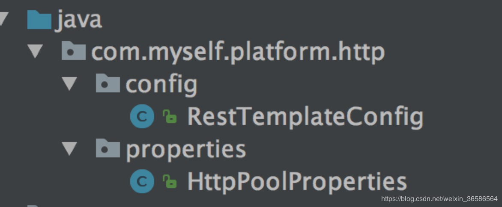

# springboot使用RestTemplate+httpclient连接池发送http消息

## 描述

* RestTemplate是spring支持的一个请求http rest服务的模板对象，性质上有点像jdbcTemplate

* RestTemplate底层还是使用的httpclient(org.apache.http.client.HttpClient)发送请求的。

* HttpClient可以做连接池，而发送消息的工具类可以使用RestTemplate，所以如果你的项目需求http连接池，RestTemplate+httpclient连接池是一种不错的方式，可以节省开发工作，也可以更优雅的使用。

## 配置

> maven依赖

```java
    <dependency>
        <groupId>org.apache.httpcomponents</groupId>
        <artifactId>httpclient</artifactId>
        <version>4.5.6</version>
    </dependency>
 
    <dependency>
        <groupId>org.springframework.boot</groupId>
        <artifactId>spring-boot-starter-web</artifactId>
    </dependency>
```

> Java配置类



### httpConfig.properties

```java
    http.maxTotal=500  
    http.defaultMaxPerRoute=300  
    #设置连接超时时间，单位毫秒  
    http.connectTimeout=10000  
    #http clilent中从connetcion pool中获得一个connection的超时时间,单位毫秒  
    http.connectionRequestTimeout=500  
    #请求获取数据的超时时间，单位毫秒。 如果访问一个接口，多少时间内无法返回数据，就直接放弃此次调用 
    http.socketTimeout=15000  
    http.staleConnectionCheckEnabled=true  
```

## java代码

```java
    import lombok.Data;
    import org.springframework.boot.context.properties.ConfigurationProperties;
    import org.springframework.context.annotation.PropertySource;
    import org.springframework.stereotype.Component;

    
    @Component
    @PropertySource(value= {"classpath:properties/httpConfig.properties"})
    @ConfigurationProperties(prefix = "http.pool.conn")
    @Data
    public class HttpPoolProperties {
        private Integer maxTotal;
        private Integer defaultMaxPerRoute;
        private Integer connectTimeout;
        private Integer connectionRequestTimeout;
        private Integer socketTimeout;
        private Integer validateAfterInactivity;
    }

```
```java
import org.apache.http.client.HttpClient;
import org.apache.http.client.config.RequestConfig;
import org.apache.http.config.Registry;
import org.apache.http.config.RegistryBuilder;
import org.apache.http.conn.socket.ConnectionSocketFactory;
import org.apache.http.conn.socket.PlainConnectionSocketFactory;
import org.apache.http.conn.ssl.SSLConnectionSocketFactory;
import org.apache.http.impl.client.HttpClientBuilder;
import org.apache.http.impl.conn.PoolingHttpClientConnectionManager;
import org.springframework.beans.factory.annotation.Autowired;
import org.springframework.context.annotation.Bean;
import org.springframework.context.annotation.Configuration;
import org.springframework.http.client.ClientHttpRequestFactory;
import org.springframework.http.client.HttpComponentsClientHttpRequestFactory;
import org.springframework.http.converter.HttpMessageConverter;
import org.springframework.http.converter.StringHttpMessageConverter;
import org.springframework.web.client.RestTemplate;

import java.nio.charset.StandardCharsets;
import java.util.List;

/**
 * Created by qxr4383 on 2018/12/25.
 */
@Configuration
public class RestTemplateConfig {

    @Autowired
    private HttpPoolProperties httpPoolProperties;

    @Bean
    public RestTemplate restTemplate() {
        RestTemplate restTemplate = new RestTemplate(httpRequestFactory());
        List<HttpMessageConverter<?>> converterList = restTemplate.getMessageConverters();

        //重新设置StringHttpMessageConverter字符集为UTF-8，解决中文乱码问题
        HttpMessageConverter<?> converterTarget = null;
        for (HttpMessageConverter<?> item : converterList) {
            if (StringHttpMessageConverter.class == item.getClass()) {
                converterTarget = item;
                break;
            }
        }
        if (null != converterTarget) {
            converterList.remove(converterTarget);
        }
        converterList.add(1, new StringHttpMessageConverter(StandardCharsets.UTF_8));
        return restTemplate;
    }

    @Bean
    public ClientHttpRequestFactory httpRequestFactory() {
        return new HttpComponentsClientHttpRequestFactory(httpClient());
    }

    @Bean
    public HttpClient httpClient() {
        Registry<ConnectionSocketFactory> registry = RegistryBuilder.<ConnectionSocketFactory>create()
                .register("http", PlainConnectionSocketFactory.getSocketFactory())
                .register("https", SSLConnectionSocketFactory.getSocketFactory())
                .build();
        PoolingHttpClientConnectionManager connectionManager = new PoolingHttpClientConnectionManager(registry);
        connectionManager.setMaxTotal(httpPoolProperties.getMaxTotal());
        connectionManager.setDefaultMaxPerRoute(httpPoolProperties.getDefaultMaxPerRoute());
        connectionManager.setValidateAfterInactivity(httpPoolProperties.getValidateAfterInactivity());
        RequestConfig requestConfig = RequestConfig.custom()
                .setSocketTimeout(httpPoolProperties.getSocketTimeout()) //服务器返回数据(response)的时间，超过抛出read timeout
                .setConnectTimeout(httpPoolProperties.getConnectTimeout()) //连接上服务器(握手成功)的时间，超出抛出connect timeout
                .setConnectionRequestTimeout(httpPoolProperties.getConnectionRequestTimeout())//从连接池中获取连接的超时时间，超时间未拿到可用连接，会抛出org.apache.http.conn.ConnectionPoolTimeoutException: Timeout waiting for connection from pool
                .build();
        return HttpClientBuilder.create()
                .setDefaultRequestConfig(requestConfig)
                .setConnectionManager(connectionManager)
                .build();
    }

}

```

## 使用方法

### 直接获取ResponseEntity的body转换为你需要的对象即可

```java
@Autowired
    private ObjectMapper objectMapper;
    @Autowired
    private RestTemplate restTemplate;
    @Override
    public WeatherApiPojo getWeather(String requestUrl) {
        WeatherApiPojo weatherApiPojo = new WeatherApiPojo();
        try {
            logger.info("I'm going to send request: " + requestUrl);

            ResponseEntity<String> responseEntity = restTemplate.getForEntity(requestUrl,String.class);
            if (responseEntity!=null && responseEntity.getStatusCodeValue()==200){
                objectMapper.configure(DeserializationFeature.FAIL_ON_UNKNOWN_PROPERTIES, false);
                weatherApiPojo = objectMapper.readValue(responseEntity.getBody(), WeatherApiPojo.class);
            } else {
                weatherApiPojo.setCode("-1");
            }
            return weatherApiPojo;
        } catch (Exception e) {
            logger.error("获取第三方天气API接口getWeather error {} ", e);
            weatherApiPojo.setCode("-1");
        }
        return weatherApiPojo;
    }
```
